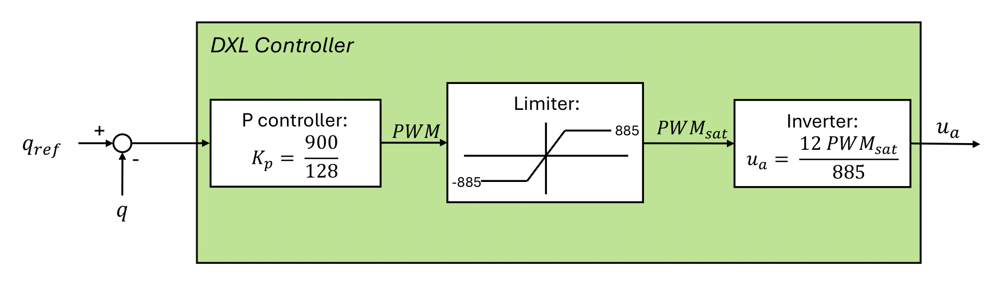
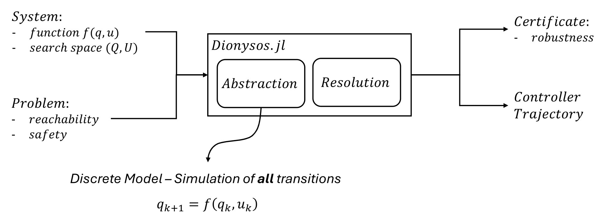

# 🤖 Pheidippides

Philippideis is a project focused on **abstraction-based control** for a **5-link planar robot**, implemented using [Dionysos.jl](https://github.com/julienCalbert/Dionysos.jl).

This repository includes multiple simulation environments based on both **JuliaRobotics** and **Robotran**. It features a position control only environments to reproduce gaits with position trajectories. It also explores abstraction-based control synthesis using **Dionysos.jl**, developed by Julien Calbert.

## 📌 Requirements

- Linux
- Git
- Julia (recommended version: 1.10.2 -> 1.11.2)
- Robotran (for C/Python-based simulations)

## 📥 Installation

First create a folder in your home directory: <br>
```bash
mkdir .robotran
cd .robotran
```
Then in this directory, download [Robotran](https://www.robotran.be/download/), the MBSysC and the MBSysPad, as well as the python package MBSysPy (follow the instruction provided in the [Installation Instructions](https://robotran-doc.git-page.immc.ucl.ac.be/Installation-Instruction/Linux/#))
).

In the same repository, clone the git:

```bash
git pull
git submodule update --init --recursive
```


## 📁 Folder Structure

- `Dionysos.jl/`: Library for abstraction-based controller synthesis, developed by **Julien Calbert**.
- `JuliaRobotics/`: Simulates the robot using motor position control, solved with **JuliaRobotics**.
- `Robotran_c/` and `Robotran_py/`: Similar simulations to `JuliaRobotics/` using **Robotran** instead.
- `Robotran_J2C/`: A modified version of `Robotran_c` adapted for integration with **Dionysos.jl**.


## 💡 More Specifically

### 1. Position Control Environments

This chapter covers basic position control simulations for the 5-link planar robot. This position controller is included in the Dynamixels motors by the manufacturer:<br>
 <br>
The controller outputs a tension, which is converted to torque using the following DC motor model (at the motor level): <br>
$$\tau = k'_t u_a - (\tau_c + K'_v \dot{q})$$ 

The implemented formula is slightly different as the torques need to be at the joint levels, introducing the gear ratios in the formula.

#### 1.1 JuliaRobotics
The folder `JuliaRobotics/` contains the simulation environment of Pheidippideis using JuliaRobotics, and is divided into four folders:
- `deps/`: contains the simulation results.
- `deps/`: contains the URDF.
- `Simulator/`: contains the code. `RobotSimulator.jl/` contains all the specific functions (ground contact, controllers, ...), while `simulation_controller.jl/` runs the code.
- `WalkingPatterns/`: contains the position trajectories to follow. <br>

The codes allows to either use the position controller (data_from_WP = true) or to directly apply voltages (data_from_WP = false). To run the code :
```bash
julia
;
cd JuliaRobotics/
(suppr key to come back)
]
activate .
update
instantiate
(suppr key to come back)
include("Simulator/simulation_controller.jl")
exit()
```
As explained in our master thesis, feeding the voltages measured on the physical robot in open-loop does not work in the current state, as the simulation is not able to reproduce the ZMP trajectory.<br>
Note that on the real robot, two motors are mounted in the other direction. This implies that their signals need to be multiplied by -1. The save order in the LabView also differs from the URDF index, implying the need to swicth some rows in the data obtained in the real robot.

#### 1.2 Robotran
The folders `Robotran_c/` and `Robotran_py/` follow a similar implementation to `JuliaRobotics/`, but uses MBS files instead of URDF. The python version is used for feature development dur to is ease for debugging, while the c implementation is used for its computation speed capabilities. Both implementations follow the same structure. The main folders are:
- `dataR/`: contains the mbs file of the robot. Note that if a modification is applied to the mbs, the symbolic files need to be updated (via the MBSysPad).
- `resultR/`: contains the results of the simulations.
- `userfctR/`: contains the code for the simulation. The used_DrivenJoints, user_ExtForces and usedJointForces are respectively used to drive joints (for isntance to zero for the hip), to apply external forces (ground contact) and to apply torques or forces at the joint level (motor torques).
- `WalkingPatterns/`: contains the position trajectories to follow.
- `workR/`: runs the code.
In C there is an additionnal folder:
- `structures/`: allows to access any structures from anywhere in the code, as long as it is defined in the structures.c and the structures.h. The CMakeFile has been modified accordingly. (/!\ follow the instruction in this code for new structures)
In some cases, an additionnal folder was added to save the results such that they won't be erased by new simulations:
- `data`

This implemntation only allows for position control. To run the code:
- In Python:
```bash
cd Robotran_py/workR/
python3 main.py
```
- In C:
```bash
cd Robotran_c/workR/
mkdir build
cd build
cmake .. -DCMAKE_PREFIX_PATH="~/.robotran/mbsysc/MBsysC/install
make
./exe_robotran_c
```

### 2. Abstraction-Based Control Environments
Once the simulator has been tested with usual control techniques (ZMP), we can move on with a novel techique: abstraction-based control. As shown in the figure here below, we have to define a system and a problem. More information is available in the master thesis. <br>
 <br>
 The system implementation is represented in the following figure: <br>
 <br>
The folders we will work with are all the folders in `Dionysos.jl/problems/Biped_robot/`. For both simulators, two folders are available, to test Dionysos with its two possible working principle: a trajectory generator (used along with the Position Control Environment afterwards), or a controller generator. Note that the folder `Complete _ranges` has been created for completeness, but its computational complexity is way too high (more than a lifetime computation time).

 Each of this folder will contain two files:
- `robot_problem.jl`: contains the system definition. It includes the fill_state functions (State Extension) and either a call to JuliaRobotics either to Robotran. It also includes the system's state space and input space bounds. Note that this system is a simplified system and only contains 9 dimensions (compared to the 20 dimensions of the complete system).
- `robot_example.jl`: contains the problem definition. In the case of trajectory generator validation, the asbtraction is first computed (and saved in the file `Abstraction.jld2` as it takes a lot of time to compute), and the controllers derived. The controllers are then tested on the simplified system to retrieve the trajectory. This implementation is finally validated with the Position Controller Environment (i.e. on the complete system). In the case of the controller validation, the controllers derived in the trajectory are used on the complete system, along with a memory to bypass the fill_state function. The controllers from the trajectory generation validation are saved in the files `First_step.jld2` and `Second_step.jld2`, by saving the whole optimizer in the corresponding folder. Note that some of the data of the optimizer can't be saved such as functions calls, and have to be re-defined in the folders controller validation.

#### 2.1 Technical considerations : JuliaRobotics + Dionysos.jl (`Dionysos.jl`)
The folder `Dionysos.jl/problems/Biped_robot/Julia_Trajectory_obtention/` allows to obtain a position trajectory (`Dionysos_JR_trajectory.csv`), validated with the folder `JuliaRobotics` in position control. The controllers obtained are saved (`First_step.jld2` and `Second_step.jld2`), then validated in the folder `Julia_Controller_validation`. <br>
The JuliaRobotics simulator is directly implemented in the folders. The URDF is available in the folder `Dionysos.jl/problems/Biped_robot/deps/`.


#### 2.2 Technical considerations : Robotran + Dionysos.jl (`philippides_J2C` and `Dionysos.jl`)
The use of Robotran along with Dionysos is a little bit more challenging. First of all, it requires in Robotran a library (.so) instead of using an executable. This was implemented by modifying Robotran's CMakeList. The main also needs to be revised, as there is no main function, but only function that will be called from Dionysos through Julia. Those functions are init(), free() to handle the memory, as well as the philippides(x) function to run the simulation with x as (state,input) and get_results_() to retrieve the results. <br>
Concerning Dionysos, the codes are nearly the sames as in Julia. They differ on the initialisation and the free handling the structures memory in C, called in the `robot_exemples.jl`. The philippides and get_results functions are called in `robot_problem.jl`.

## 👤 Authors

Developed by **[Cédric Amerijckx, Maxime Morabito]**, with the help of **[Antonin Perilleux]**.

Abstraction-based control library `Dionysos.jl` developed by **Julien Calbert**.
